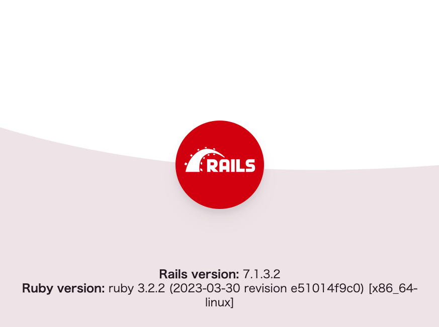

# Docker

## Dockerとは
Dockerは、「**コンテナ型の仮想環境を作成、共有、実行するためのプラットフォーム**」です。

### コンテナ is 何？

**コンテナとは**
* Dockerエンジンの上に立つ一つの箱
* 箱の中には特定したもの
* コンテナに何を入れるか、を考える

### 簡単に言うと、マシン内の入れ物に任意のものを入れられる便利な箱！！

<br>

# 作ってみた!
### 任意のディレクトリを作成
```shell
mkdir rails_docker && cd rails_docker
```

### 必要ファイルの作成
```bash
touch {Dockerfile.dev,compose.yml,.env,Gemfile,Gemfile.lock,entrypoint.sh}
```

* Dockerfile.dev(DockerfileをDockerfile.devという名前で作成)
* compose.yml
* .env
* Gemfile
* Gemfile.lock
* entrypoint.sh

### Dockerfile
DockerfikeとはDockerイメージを構築するための設計図のようなものです。つまり、Dockerfileを編集することで環境構築できるようになります。

**一つ一つのコンテナの詳細が書かれたファイル**

<br>

```docker:Dockerfile.dev
FROM ruby:3.2.2

# コンテナの作業ディレクトリ
WORKDIR /app

# コンテナの作業ディレクトリにコピー
COPY Gemfile Gemfile.lock /app/

# 依存関係をインストール
RUN bundle install

COPY entrypoint.sh /usr/bin/
# プロジェクト作成時はコメントアウト（コンテナが立ち上がらないため）
# RUN chmod +x /usr/bin/entrypoint.sh
# ENTRYPOINT ["entrypoint.sh"]

EXPOSE 3001

# プロジェクト作成時はCMDをコメントアウト（コンテナが立ち上がらないため）
# CMD ["rails", "server", "-b", "0.0.0.0"]
```

### Dockerfileの構文
Dockerfileは命令の引数により構成されます。一行につき一つの命令が与えられ実行する際に一行目から順番で実行されます。

``
{命令} {引数}
``

以下が命令の一例です。

| 命令 | 使用用途 |
|:---- |:------- |
|FROM |ベースイメージを指定する|
|RUN |コマンドを実行する|
|CMD |コンテナの実行コマンド|
|ENV |環境変数の指定|
|COPY |ファイルコピー|


### Docker Compose
Dockerを利用した開発では複数のコンテナを起動して、コンテナ間の通信を行う必要があります。
今回はRailsを動かすコンテナとMySQL(DB)を動かすコンテナを起動します。いちいち手動でコンテナの起動などを行うのは連携するコンテナが増えると面倒になってきます。その手間を解消するために必要となるのが、**Docker Compose**です。

Docker Composeでは、**compose.yml**と呼ばれるDockerに対する指示書を作成します。Dockerはこの指示書に基づいて複数のコンテナを同時に起動します。
**複数のコンテナを管理するファイル**

### YMLファイル
`db`という欄でMySQLのコンテナの起動に関する設定をし、`web`という欄でRailsサービス起動に関する設定をしています。
この`db`という名前で、後ほどRailsからMySQLにアクセスするための設定をしていきます。

```yaml:compose.yml
services:
  web:
    container_name: sample_app
    build:
      context: .
      dockerfile: Dockerfile.dev
    # プロジェクト作成時はcommandをコメントアウト（コンテナが立ち上がらないため）
    # command: bash -c "rm -f tmp/pids/server.pid && bundle exec rails s -p 3000 -b '0.0.0.0'"
    volumes:
      - .:/app
    env_file:
      - .env
    ports:
      - ${RAILS_PORT}:3000 # 環境変数から参照
    tty: true
    # 標準入出力とエラー出力をコンテナに結びつける設定。
    stdin_open: true
    depends_on:
      - db
  # MySQLの設定
  db:
    container_name: sample_db
    image: mysql:8.0
    volumes:
      - db-data:/var/lib/mysql
    environment:
      MYSQL_DATABASE: ${MYSQL_DB} # 環境変数から参照
      MYSQL_ROOT_PASSWORD: ${MYSQL_ROOT_PASSWORD} # 環境変数から参照
      TZ: "Asia/Tokyo"
    ports:
      - "${MYSQL_POOT}:3306" # 環境変数から参照
volumes:
  db-data:
```

### Gemfile
```:Gemfile
source 'https://rubygems.org'
gem 'rails'
```
Railsのバージョンが7であることを指定できました。

### entrypoint.sh の編集
このファイルは、コンテナ起動時に実行するスクリプトを記述するためのファイルです。

```sh:entrypoint.sh
#!/bin/bash
set -e

# Remove a potentially pre-existing server.pid for Rails.
rm -f /myapp/tmp/pids/server.pid

# Then exec the container's main process (what's set as CMD in the Dockerfile).
exec "$@"
```
ここではRailsでよくある`server.pid`のエラーを回避するために、一度`server.pid`を削除しています。

また、最後の`exec "$@"`は、コンテナ起動時に実行するコマンドを指定するためのものです。
これにより、Dockerfileで指定した`CMD ["rails", "server", "-b", "0.0.0.0"]`が実行されます。

これでスタート時点で必要なファイルは準備できました！

## コンテナイメージ作成
```
docker compose build
```

## コンテナの起動
```shell
docker compose up -d
```

## Rails プロジェクトの作成
まずdocker-compose コマンドを使って`rails new`を実行し、Railsプロジェクトを作成します。

```shell
docker-compose exec web rails new . -f -d mysql -T
```

`docker-compose exec`を使用することで、Dockerコンテナ内でコマンドを実行できます。コンテナ内で実行したいコマンド（=rails コマンド) を続けています。

* -f 既存のファイルがある場合は上書き
* -d データベースを指定(今回はMySQL)
* -T テストファイルを生成しない

コマンド実行後、`rails new` した時と同じように、ディレクトリ内に `app` や `config` などのフォルダが作成されていることが確認できると思います。

### 生成されたDockerfileのファイル名を変更
Rails7.1から本番用のDockerfileが自動で生成されるので、自動生成されたファイル名を`Dockerfile.prod`に変更。


### MySQL データベースの準備
次に、データベースの準備をしていきます。

まずは Rails で使用しているデータベースファイルの設定を編集します。
config ディレクトリ内の **database.yml** というファイルが対象です。

```yaml:config/database.yml
default: &default
  adapter: mysql2
  encoding: utf8mb4
  pool: <%= ENV.fetch("RAILS_MAX_THREADS") { 5 } %>
  database: <%= ENV.fetch("MYSQL_DB") { '' } %> #.env 環境変数を参照
  username: <%= ENV.fetch("MYSQL_USER") { '' } %> #.env 環境変数を参照
  password: <%= ENV.fetch("MYSQL_ROOT_PASSWORD") { '' } %> #.env 環境変数を参照
  host: db #docker-compose.ymlのDBのサービス名を指定

development:
  <<: *default
  database: <%= ENV.fetch("MYSQL_DB") { '' } %>_development #.env 環境変数を参照

test:
  <<: *default
  database: <%= ENV.fetch("MYSQL_DB") { '_test' } %>_test #.env 環境変数を参照

# production　プロジェクトに合わせて修正。
production:
  <<: *default
  database: app_production
  username: app
  password: <%= ENV["APP_DATABASE_PASSWORD"] %>
```

ポイントは、`host` の欄が `db` であることです。

`db` は docker-compose.yml で指定した MySQL のコンテナ名ですね。
同じ docker-compose.yml で指定したコンテナ間であれば、 コンテナ名をホストとして名前解決してアクセスすることができます。

これで Rails がデータベースと連携できるようになったので `rails db:create` コマンドを docker-compose 経由で実行して データベースを作成しておきましょう。

### DBの作成
```shell
docker-compose exec web rails db:create
```

### Dockerfile.devとcompose.yamlのコメントアウトを外す
```docker:Dockerfile.dev
# RUN chmod +x /usr/bin/entrypoint.sh
# ENTRYPOINT ["entrypoint.sh"]
CMD ["rails", "server", "-b", "0.0.0.0"]
```

```:compose.yaml
command: bash -c "rm -f tmp/pids/server.pid && bundle exec rails s -p 3001 -b '0.0.0.0'"
```

### コンテナイメージの再作成とコンテナの起動
```
docker compose build
```

```
docker compose up -d
```

### サーバ起動
ブラウザで http://localhost:3001/ を開きます。
環境構築が出来ていれば、画像のページが表示されます。

